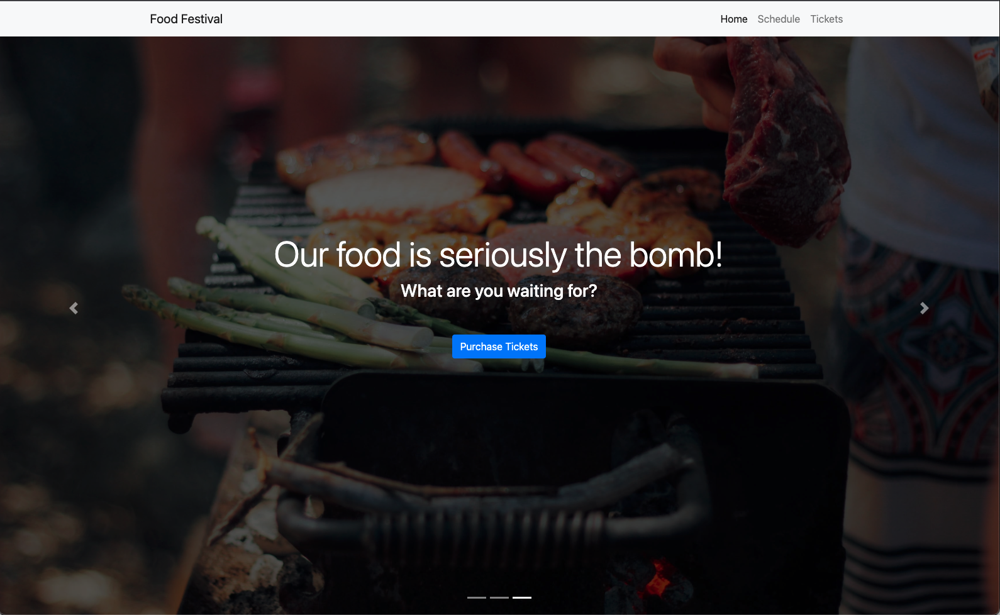

  # Food Festival
  

  ## Description
  A hypothetical website for the user to purchase tickets and receive information about a regional food festival.

  ## Table of Contents
  * [Installation](#installation-instructions)
  * [Usage](#usage)
  * [Technologies](#technologies)
  * [Questions](#questions)
  

  ## Installation Instructions
  Navigate to [Food Festival Site](https://harvbcoding.github.io/food-festival/)

  ## Usage
  Once on the homepage, a user can purchase tickets and view the schedule for the regional food festival

  
  
  ## Technologies

  JavaScript, JQuery, Bootstrap, HTML CSS, webpack
  

  ## Questions
  If you have any questions or need to report bugs please reach out to me at [HarvBCoding](https://www.github.com/HarvBCoding) or harvey.breania@gmail.com
  
  

